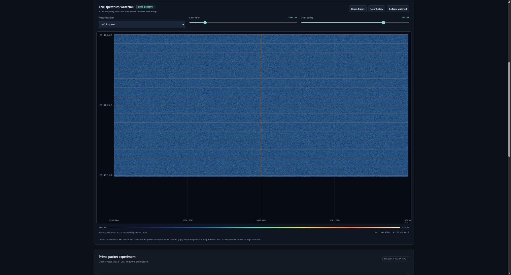
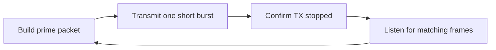

# NHI Communicator

**A free, open-source HackRF One app for live spectrum viewing and simple prime-number packet experiments.**

Watch an 8 MHz receive spectrum in a high-resolution waterfall, build unencrypted packets containing prime numbers, and test a repeated transmit/listen cycle in a shielded, attenuated laboratory setup. Everything runs locally in your browser; no account, subscription, cloud service, or telemetry is required.

The project was inspired by the radio-frequency experiments featured in HISTORY's **[The Secret of Skinwalker Ranch](https://www.history.com/shows/the-secret-of-skinwalker-ranch)**. It is an independent hobby project with a **1.600 GHz laboratory preset**. It is not affiliated with the show, HISTORY, the ranch, or Great Scott Gadgets. The name describes the experiment's inspiration; the software does not identify non-human intelligence or implement a validated NHI communication protocol. [More about the show and this project's scope](docs/SKINWALKER_RANCH.md).

## What you can do

- View actual HackRF receive samples as an **8,192-bin waterfall** with roughly **977 Hz bin spacing** at 8 MS/s.
- Zoom the display, adjust its colors and level range, pause scrolling, and expand the waterfall.
- Preview packets containing the first **1–64 prime numbers**, a sequence number, and CRC32.
- Run short **2-FSK transmit bursts followed by listening windows** in a shielded conducted test setup.
- Adjust the RF amplifier and **0–47 dB TX gain**, and inspect packet counts, receive gaps, and radio errors.
- Decode matching laboratory frames and distinguish them from ordinary received energy.



This example is an actual receiver capture. The center line and noise are measurements, not an identified source or a decoded response.

[See the standalone app interface and its explanation panel](docs/images/app.png).

## Download and open

1. Download **`nhi-communicator-v0.1.1-windows-x64.zip`** from **[the latest release](https://github.com/Teylersf/nhi-communicator/releases/latest)**.
2. Extract the complete ZIP into a folder. Keep the bundled files together.
3. Run **`NHI Communicator.exe`** or **`Start NHI Communicator.cmd`**. Python is not required for the Windows release.
4. Open the displayed local address in Chrome or another current browser. The default is **http://127.0.0.1:8787**.

The app opens with transmission off. Loading the page, previewing a packet, changing gain, or viewing a waterfall does not start transmission. Use **`Start Preview.cmd`** or launch with `--demo` to inspect the interface and generate offline packet previews without opening a radio. Choose **Quit app** before switching between normal, preview, and shielded-lab launchers; it shuts down radio operations and the local service.

The Windows application is unsigned, so Windows may show a publisher or SmartScreen notice. Check that the ZIP came from this repository and compare its checksum with the release's checksum file.

**Hardware:** HackRF One, Windows 10/11 x64, a working USB data cable, and the WinUSB driver for the HackRF. Close other radio programs before opening the device. The portable release includes the host tools and native control helper; it does not install a USB driver or change your firmware. See [HackRF's official installation guidance](https://hackrf.readthedocs.io/en/latest/installing_hackrf_software.html) if your computer does not detect the radio.

## Receive and read the waterfall

Start receive to see samples from the radio. Frequency runs left to right and the newest time row appears at the top. At the default 1,600 MHz center, the display spans approximately **1,596–1,604 MHz**. Bright marks indicate received energy, not decoded messages. Levels are relative and uncalibrated; a central line can be a receiver DC artifact.

Zoom and color controls change the display only. **Pause display** freezes its history while the receiver continues. Gray separators mark gaps or a new receive window. FFT snapshots update at most five times per second, so the display is not a continuous recording of every sample. [Waterfall and measurement details](docs/HOW_IT_WORKS.md#the-waterfall).

## Run a contained prime-packet test

Use the lab launcher/profile only with a **shielded conducted setup and suitable attenuation**. A software checkbox cannot provide RF shielding. This app's 1.600 GHz transmit profile is for contained equipment tests, not transmission into an antenna. Do not connect a transmitter directly to another radio's input without appropriate attenuation; consult the [HackRF input-power limit](https://hackrf.readthedocs.io/en/latest/hackrf_one.html).

Run **`Start Shielded Lab.cmd`** or launch with `--shielded-test`, confirm the physical setup in the interface, select a prime count, then choose **Start shielded packet loop**. The interface uses a four-second listening window. The cycle is:



HackRF One is **half duplex**: it transmits or receives at one time, with a switching gap between them. A single device cannot hear a reply arriving during its own burst or that gap. A contained setup needs a second compatible radio or test source to produce a reply; primes do not cause an automatic response.

Use **Stop loop** before disconnecting equipment. If shutdown is unconfirmed, stop the test and resolve the USB error. Gain settings affect the next burst and do not start one by themselves. Maximum gain is a hardware setting, not a calibrated output-power or range claim.

## How it works

The app generates readable ASCII such as:

```text
NHI-LAB|v1|SEQ=000001|PRIMES=2,3,5,7,11|CRC32=99841E1F
```

A newline ends the packet. An outer binary frame adds synchronization, payload length, and another CRC32. The modem converts its bits into two frequency tones at **8,000 bits/s**. With the 1.600 GHz tuning preset, the tone centers are **1,600.080 MHz for 0** and **1,600.120 MHz for 1**.

On receive, a candidate must match the frame and checksums, then contain the canonical prime sequence. A valid checksum detects accidental corruption; it does not authenticate a sender or prove a signal's origin. An outbound-packet match can be a replay or echo. The decoder is deliberately simple and does not decode arbitrary signals, speech, satellites, or the show's unknown signals.

Read **[How it works](docs/HOW_IT_WORKS.md)** for the complete packet format, modulation, FFT math, and USB recovery rules.

## Run from source

Use Python 3.10 or newer and run these commands from the repository root:

```powershell
python -m pip install -r requirements.txt
python launch.py --demo
```

For radio use, provide the Windows native host tools and built control helper described in [the build documentation](docs/BUILD.md), then launch normally. A release installation already includes those files.

```powershell
python launch.py
```

Useful options include `--tools-dir <bin-folder>`, `--serial <32-hex-digit-serial>`, `--data-dir <writable-folder>`, `--port <port>`, and `--no-browser`. With no serial supplied, discovery requires exactly one connected device. `--receive` explicitly starts reception; `--shielded-test` enables the contained lab controls. Run `python launch.py --help` for the complete current options.

Local settings and receipts are stored in `%LOCALAPPDATA%\NHICommunicator` on Windows by default. They are kept outside the installation folder and are not published with this repository.

## Source, license, and contributing

The original application code is **[MIT licensed](LICENSE)**. Bundled HackRF and other third-party components retain their own licenses; see **[Third-party notices](THIRD_PARTY_NOTICES.md)**. The Windows release includes their license files, and **`third-party-source-v0.1.1.zip`** provides corresponding native source and build information alongside the application download.

Bug reports should include your OS, app version, HackRF firmware/host versions, the action that failed, and the first meaningful error line. Remove device serials and personal paths before posting logs. Reproduce protocol changes with offline tests before conducting an RF test.
