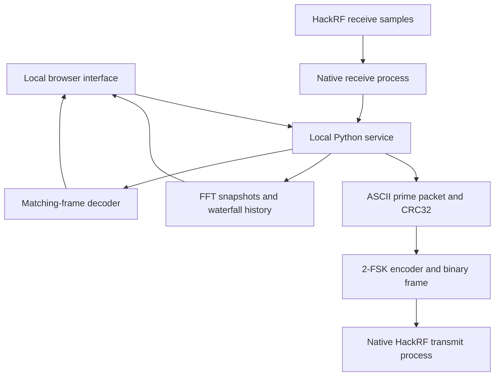

# How NHI Communicator works

The browser controls a local Python service. That service creates packets and waveforms, starts native HackRF transfer processes, analyzes actual receive samples, and serves the display at a loopback address. It keeps transmit and receive ownership separate so one radio operation runs at a time. The native control helper performs checked device information and shutdown operations.



## Prime packets

Each packet contains the first selected number of primes, always beginning with 2. The selectable count is 1–64. Primes make a deterministic, recognizable test payload; they are not an established universal handshake.

The byte format is:

```text
NHI-LAB|v1|SEQ=ssssss|PRIMES=p1,p2,...,pn|CRC32=hhhhhhhh\n
```

- `ssssss` is a six-digit decimal sequence number from `000001` through `999999`.
- `p1,p2,...,pn` is the canonical first N primes, separated by commas with no spaces.
- `hhhhhhhh` is the uppercase, eight-digit CRC32 of all ASCII bytes before `|CRC32=`.
- `\n` denotes one newline byte (`0A`), not two literal characters.

There is **no encryption, sender identity, signature, or timestamp in the transmitted packet**. `created_utc` is local generation metadata only. Sequence numbers help compare packets; they are not authentication or anti-replay protection. CRC32 detects accidental byte corruption and can be reproduced by anyone.

To build and inspect a real packet offline, run from the repository root:

```powershell
python -c "import sys; sys.path.insert(0, 'dashboard'); from prime_packets import build_packet; print(build_packet(1, 5)['payload_text'], end='')"
```

## The radio frame

The modem wraps the ASCII packet in this binary frame. Multi-byte fields are big endian, and bits are sent most significant bit first.

| Field | Length | Value or meaning |
| --- | ---: | --- |
| Preamble | 64 bits | Alternating `1,0`, repeated 32 times |
| Sync | 32 bits | Hex `D3 91 DA 26` |
| Length | 16 bits | Number of payload bytes |
| Payload | Variable | The complete ASCII prime packet, including its newline |
| Outer CRC32 | 32 bits | CRC32 of all payload bytes |

The modem permits payloads up to 4,096 bytes; the prime-packet parser applies its own smaller 512-byte limit. The decoder requires a matching sync word, bounded complete payload, and matching outer CRC. It then validates the inner packet format, checksum, sequence bounds, and canonical primes.

## Two-frequency modulation

The app generates continuous-phase binary FSK as signed 8-bit, interleaved I/Q bytes. At the default settings:

| Parameter | Value |
| --- | ---: |
| Sample rate | 8,000,000 complex samples/s |
| Bit rate | 8,000 bits/s |
| Samples per bit | 1,000 |
| Tuning center | 1,600,000,000 Hz |
| Baseband offset | +100,000 Hz |
| Deviation | ±20,000 Hz |
| Bit 0 tone | 1,600.080 MHz |
| Bit 1 tone | 1,600.120 MHz |
| I or Q peak amplitude | 8 on a signed 8-bit scale |

A payload of L bytes produces `(144 + 8L) / 8000` seconds of waveform. The tone centers are nominal values; hardware clock error can shift the measured frequencies. Real FSK bursts also have spectral width, so the listed tones are not a statement that energy exists only at two infinitesimal frequencies.

The RX decoder uses phase differences and symbol integration. It examines symbol alignments, locates the sync word, and checks frames. It is a fixed-rate lab modem without adaptive clock recovery, forward error correction, arbitrary-frequency search, or automatic recognition of other protocols. A compatible test peer must use the same rate, framing, and frequency settings.

## Transmit, switch, listen

[HackRF One is a half-duplex transceiver](https://hackrf.readthedocs.io/en/latest/hackrf_one.html). Each loop cycle sends one finite burst, confirms the transfer stopped, then opens a receive window. The interface uses a four-second listening window; the service accepts 2–30 seconds for compatible protocol clients. Startup and USB switching add gaps, so a four-second window is not a guarantee of a four-second complete cycle.

The device cannot receive while it transmits. It also misses samples during the transition. A second compatible radio or test source is needed to send a reply at the right time. Merely transmitting primes cannot make a receiver respond.

The fixed 1.600 GHz lab profile requires a **shielded conducted setup with suitable attenuation**. The amplifier and gain controls affect the next burst. The bias supply remains off. Gain is not calibrated radiated power, and the app makes no range estimate from a slider value.

## The waterfall

The service takes measured complex samples, applies a Hann window, and calculates an 8,192-point FFT. With an 8 MHz sample rate:

```text
bin spacing = 8,000,000 / 8,192 = 976.5625 Hz
one FFT window = 8,192 / 8,000,000 = 1.024 ms
```

The bin spacing is the frequency grid, not guaranteed ability to resolve two signals exactly 977 Hz apart. Windowing, clock stability, signal strength, and the radio's analog path affect useful resolution. Display zoom enlarges existing bins; it does not collect narrower-band measurements.

Rows update at most five times per second. Each row is a short FFT snapshot rather than a recording of every sample in the interval. Brief signals between snapshots can be missed. The server retains 256 rows and a browser keeps up to 600 received rows. The browser's newest rows appear at the top, frequency runs horizontally, and color represents relative spectral level.

For transport, the waterfall clamps its relative levels to −120 through 0 dB and encodes each bin as an 8-bit color-level value. The separate receive level is also uncalibrated. Neither measurement should be read as dBm, field strength, distance, or evidence of intelligence. Receiver DC leakage can produce a line at the center; overload, local electronics, and ordinary radio signals can create other visible features.

Gray separators distinguish receive windows or missing display history. Pause and Clear control the visual history only. The actual radio is controlled by Start receive, Stop receive, and the shielded loop controls.

## USB errors and checked shutdown

Each transmit attempt has a bounded deadline. A timeout or partially started transmission is not automatically resent. The app requires the native child to actually exit and checks the stop/close receipt or performs independent mode-off control before reporting RF off. If cleanup cannot be confirmed, the UI keeps **RF shutdown unconfirmed** and blocks further operation.

The exact pinned HackRF 2024.02.1 access-denied receipt, when it proves failure occurred before TX setup, permits at most two reopen retries after checked cleanup. These attempts keep the same unsent packet, sequence, waveform, and gain snapshot. Changed or incomplete receipts, setup calls, stream-start markers, crashes, timeouts, or unconfirmed cleanup do not qualify.

A known pre-start receive open failure or a finite receive window stopped by the native idle timer can also receive bounded receive-only retries after checked cleanup. These do not resend the preceding TX packet. Only actual samples are counted, interrupted windows remain gaps, and no IQ data is joined across a gap to manufacture a frame.

The bundled host library includes guards against failed, oversized, or undersized USB serial-descriptor reads. That patch avoids a specific native range-check crash; it does not establish or cure every cause of Windows USB stalls. The source and exact patch are provided with the distribution. The app does not alter firmware.

## Local data and privacy

The service binds to `127.0.0.1`, on port 8787 by default; it is not a public web server. UI assets are local, and the app does not need cloud services. Browser extensions and other applications on the same computer are outside its control.

Receive samples stay in bounded processing buffers rather than a continuous disk recording. The current outgoing waveform is overwritten between packets. Local runtime files include persisted gain settings, the last native receive/transmit receipts, and rotated event logs. On Windows, they live under `%LOCALAPPDATA%\NHICommunicator` by default; `--data-dir` can choose another writable location. These files can contain device serials, local paths, and received data: review them before sharing and use Stop to shut down the radio before removing the USB cable.

This protocol is intentionally public and unencrypted. A CRC-valid frame proves internal consistency, not who sent it. Spectral energy and decoded laboratory messages are displayed separately.
